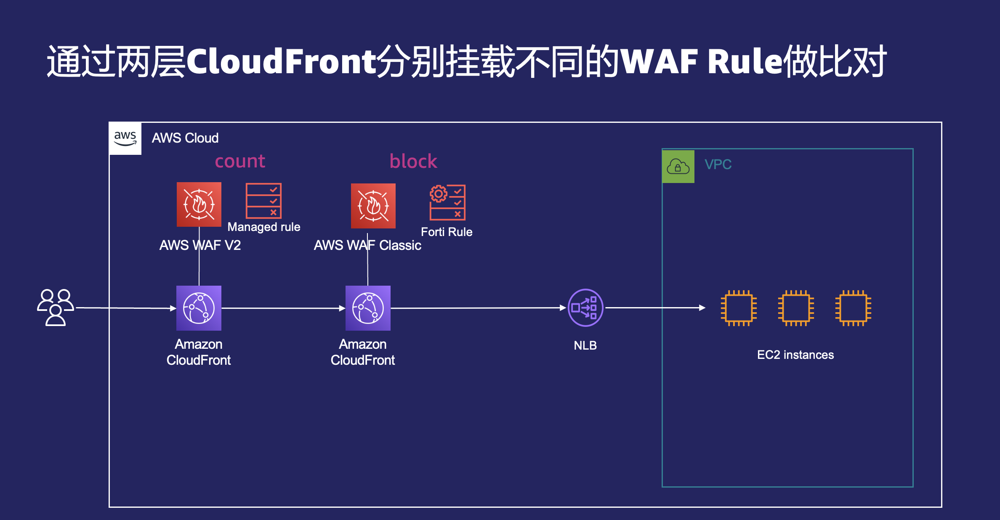
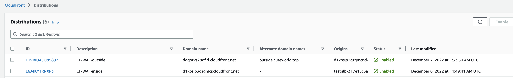
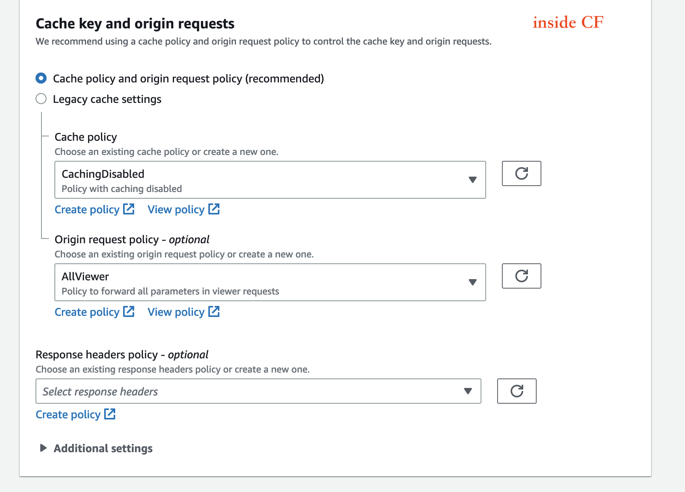
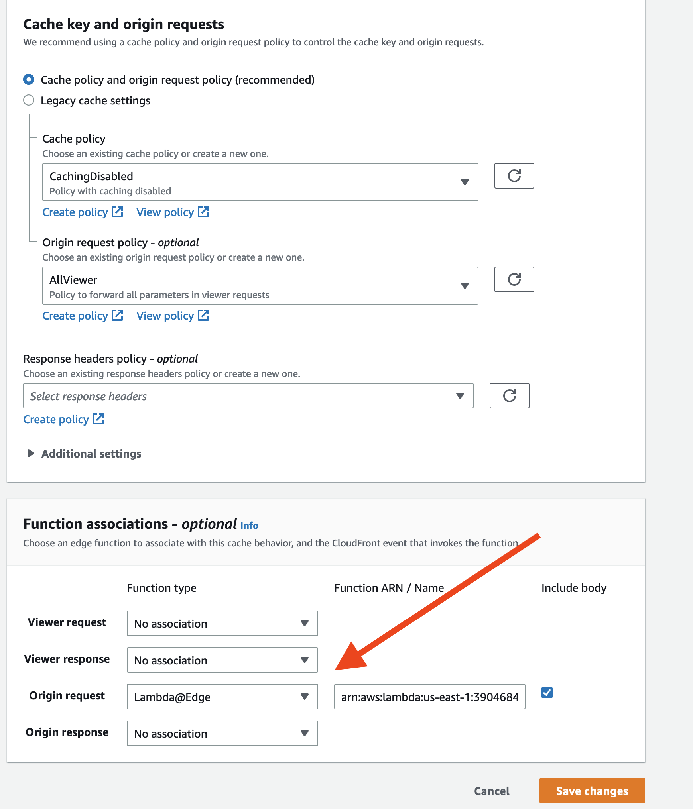
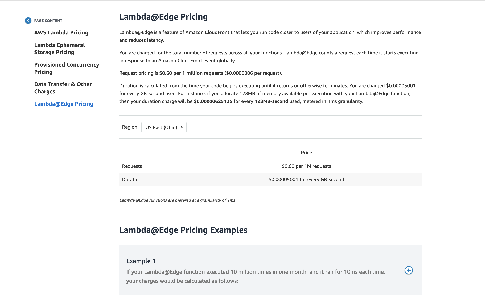

# CF套CF实现WAF规则比对



## 系统说明

EC2-NLB-CF(inside)-CF(outside - 在此配置业务域名并使用)



### EC2服务部署

#### 采用httpbin

```bash
docker run -d -p 80:80 kennethreitz/httpbin
```

### 每一层系统的访问

#### NLB

```bash
#NLB直接访问 - OK
curl -X GET -H 'customer-header:hey' http://testnlb-317e15c5ac054f49.elb.us-east-1.amazonaws.com/headers 
{
  "headers": {
    "Accept": "*/*",
    "Customer-Header": "hey",
    "Host": "testnlb-317e15c5ac054f49.elb.us-east-1.amazonaws.com",
    "User-Agent": "curl/7.79.1"
  }
}

```

#### Inside CF

```bash
#CF（inside) 直接访问 OK
curl -X GET -H 'customer-header:hey'  https://d1kbsjp3qzgmcr.cloudfront.net/headers 
{
  "headers": {
    "Accept": "*/*",
    "Connection": "Keep-Alive",
    "Customer-Header": "hey",
    "Host": "d1kbsjp3qzgmcr.cloudfront.net",
    "User-Agent": "curl/7.79.1",
    "X-Amz-Cf-Id": "TlJsvKymXEfFwrzthtTu6cYBn_Zp2-tXlvaOfZ-TabcK00CPHvnJHw=="
  }
}
```



#### Outside CF

> 为了实现WAF规则对比， 外层CF需要能够将请求所有的header, cookie, querystring全部透出传去后端CF。

> > 而一旦透传Header **Host**到内层CF, CF (outside)无法访问成功。

```html
<!DOCTYPE HTML PUBLIC "-//W3C//DTD HTML 4.01 Transitional//EN" "http://www.w3.org/TR/html4/loose.dtd">
<HTML>
<HEAD>
    <META HTTP-EQUIV="Content-Type" CONTENT="text/html; charset=iso-8859-1">
    <TITLE>ERROR: The request could not be satisfied</TITLE>
</HEAD>
<BODY>
<H1>403 ERROR</H1>
<H2>The request could not be satisfied.</H2>
<HR noshade size="1px">
Bad request.
We can't connect to the server for this app or website at this time. There might be too much traffic or a configuration
error. Try again later, or contact the app or website owner.
<BR clear="all">
If you provide content to customers through CloudFront, you can find steps to troubleshoot and help prevent this error
by reviewing the CloudFront documentation.
<BR clear="all">
<HR noshade size="1px">
<PRE>
Generated by cloudfront (CloudFront)
Request ID: LHVTSrrUTmZlNJr9yyB8ymoxrPPbsfyFGsTR6ma40cVZgD87Pivdgg==
</PRE>
<ADDRESS>
</ADDRESS>
</BODY>
</HTML
```

> CloudFront distribution 的限制，不允许以一个不对应的Host请求CF

## 解决方案

通过Lambda@Edge, 在Origin Request阶段修改Host的值为CF(inside)的域名，实现访问；

> 代码千万不要有任何错误， 嵌入到CF后不是很好调试， 最末端的callback(null, request)是必须的

```js

'use strict';

exports.handler = (event, context, callback) => {
    const request = event.Records[0].cf.request;
   
    const headers = request.headers;
    console.log("BBB The request header is " + JSON.stringify(headers));
    delete request.headers['host'];
    console.log("AAA The request header is " + JSON.stringify(headers));
    callback(null, request);
};
```

> 该函数作用在Origin Request阶段



配置成功后，

```bash
[ec2-user@ip-172-31-23-252 ~]$ curl -X GET -H 'customer-header:hey' https://outside.cuteworld.top/headers
{
  "headers": {
    "Accept": "*/*",
    "Connection": "Keep-Alive",
    "Customer-Header": "hey",
    "Host": "d1kbsjp3qzgmcr.cloudfront.net",
    "User-Agent": "curl/7.79.1",
    "X-Amz-Cf-Id": "aJu_IktJK-o5sMjTCpCo7A8Ecl1-oMhV_alKoLZOlw5ZTB1Vr-1dLQ=="
  }
}
```

## 参考文档

[Lambda@Edge IAM权限](https://docs.aws.amazon.com/AmazonCloudFront/latest/DeveloperGuide/lambda-edge-permissions.html)

[Lambda@Edge Quota 特别是RPS 10000, 酌情申请提额](https://docs.aws.amazon.com/AmazonCloudFront/latest/DeveloperGuide/cloudfront-limits.html#limits-lambda-at-edge)

[Lambda@Edge例子代码](https://docs.aws.amazon.com/AmazonCloudFront/latest/DeveloperGuide/lambda-examples.html#lambda-examples-query-string-examples)

[Lambda@Edge price](https://aws.amazon.com/lambda/pricing/)


## 几个需要注意的问题

1. 尝试通过 CloudFront Function修改Host

> The CloudFront function tried to add, delete, or change a read-only header

在Viewer request阶段 Host是read-only的， 不允许修改。 该方法行不通

2. 配置Lambda@Edge后，如何查看函数日志

请特别注意，这里一定要注意， 配置Lambda@Edge后， 函数虽然是在us-east-1定义的， 但是函数具体的日志是不一定在us-east-1的， 要看最终访问的地方命中了CloudFront的哪个region

3. 如何判断具体落在哪个region?

可以在 CloudFront-Telemetry-Monitoring-Lambda@Edge-选择具体的函数-看Metric. 看命中到哪个region, 然后定位到该region的CloudWatch对应的函数日志